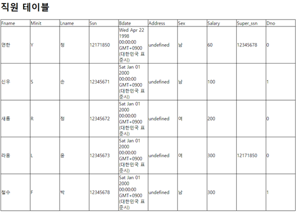

# 2021-2 DB Capstone Design

## 3주차
~~사실.. 내용이 잘 기억이 나지 않습니다...~~

그때 진행했던 내용을 보니 아마 MySQL 기본 문법과 간단한 student 테이블을 작성하는 내용을 진행한 것 같습니다.
테이블 구조는 SN, name, major, grade, email 이었네요.

## 8주차

8주차에선 직원 테이블과 부서 테이블을 작성하였었습니다.
직원 테이블은 Fname, Minit, Lname, Ssn, Bdate, Address, Sex, Salary, Super_ssn, Dno로 이루어져있었고,
부서 테이블은 Dname, Dnumber, Mgr_ssn, Mgr_start_date로 이루어져 있었습니다.

## 10주차

10주차에는 위와 같이 테이블을 작성해주었었습니다.
우선 user테이블은 Id, Password, Role로 되어있고,
department테이블은 Dname, Dnumber로 되어있었습니다.